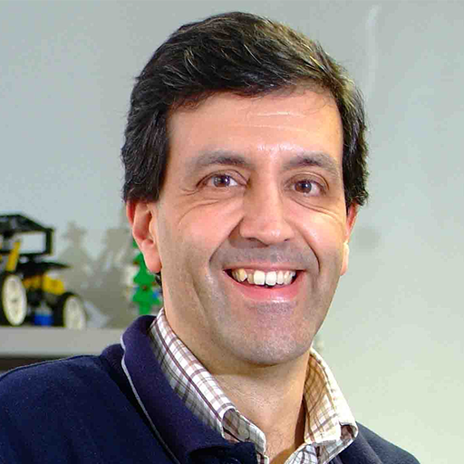
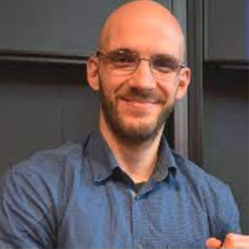

### Aim

Fleets of heterogeneous robots, such as ground vehicles and aerial vehicles, are deployed to accomplish tasks that are otherwise too inefficient or even infeasible for a single robot. Not only the overall efficiency of the team can be significantly improved by allowing the robots to move and act; but also, the capabilities of the team can be greatly extended by enabling multiple robots to directly collaborate on a task. However, their task and motion coordination are often subject to various constraints, including geometric constraints from the workspace; dynamic constraints from the robot model; and temporal constraints from the task specifications. How to address these constraints in a safe, efficient and real-time way remains an active and challenging research area. This workshop aims to bring experts in related domain (from both control and robotics background) together to brain-storm about these topics.

Particularly, we are interested in the following questions:

- Task coordination
    1. What are the challenges for task coordination of multi-robot systems, e.g., combinatorial complexity, marginal payoff, and temporal ordering of tasks?
    2. How to estimate the cost of a sub-team performing a task during planning?
    3. When and how to adapt within dynamic/adversarial environments?

- Motion coordination
    1. How to deal with geometric and dynamic constraints?
    2. How to optimize over a sequence of parameterized controllers?
    3. What if the motion planning is computationally expensive?

- Task and motion coordination
    1. How to ensure inter-robot communications?
    2. Should temporal constraints be handled at both levels?
    3. How to close the loop online during execution, periodic or event-triggered?
    4. How could learning help?

### Speakers

<table style="width: 100%;">
  <tr>
    <td width="30%" style="text-align: center; vertical-align: middle; border: none;" >
        
    </td>
    <td width="30%" style="text-align: center; vertical-align: middle; border: none;" >
        
    </td>
    <td width="30%" style="text-align: center; vertical-align: middle; border: none;">
        
    </td>
  </tr>
  <tr>
    <td style="text-align: center; vertical-align: top; border: none;">
	  <a href="https://www.kth.se/profile/petter" target="_blank">
	  <b>Petter Ögren</b> </a>
	   KTH, Sweden </td>
  <td style="text-align: center; vertical-align: top; border: none;">
	  <a href="http://users.isr.ist.utl.pt/~pal/index.html" target="_blank">
	  <b>Pedro U. Lima</b>   </a>
	   Universidade de Lisboa, Portugal</td>
    <td style="text-align: center; vertical-align: top; border: none;">
	<a href="https://scholar.google.com/citations?user=DnjQSC4AAAAJ&hl" target="_blank">
	<b>Bayu Jayawardhana</b> 	      </a>
	 University of Groningen, Netherlands</td>
  </tr>
</table>

<table style="width: 100%;">
  <tr>
    <td width="30%" style="text-align: center; vertical-align: middle; border: none;" >
        
    </td>
        <td width="30%" style="text-align: center; vertical-align: middle; border: none;">
        
    </td>
    <td width="30%" style="text-align: center; vertical-align: middle; border: none;" >
        
    </td>
  </tr>
  <tr>
    <td style="text-align: center; vertical-align: top; border: none;">
	<a href="https://leonelrozo.weebly.com" target="_blank">
	<b>Leonel Rozo</b> </a>
	 Bosch center for AI; Universität Tübingen, Germany </td>
    <td style="text-align: center; vertical-align: top; border: none;">
	<a href="https://sites.google.com/view/yulongg/home" target="_blank">
	<b>Yulong Gao</b> 	      </a>
	 Imperial College London, UK</td>
    <td style="text-align: center; vertical-align: top; border: none;">
	<a href="https://cverginis.github.io" target="_blank">
	<b>Christos Verginis</b> </a>
	 Uppsala University, Sweden </td>
  </tr>
</table>

### Organizers

<table style="width: 67%;">
  <tr>
    <td width="30%" style="text-align: center; vertical-align: middle; border: none;" >
        
    </td>
    <td width="30%" style="text-align: center; vertical-align: middle; border: none;">
        
    </td>
  </tr>
  <tr>
    <td style="text-align: center; vertical-align: top; border: none;">
    <a href="https://mengguo.github.io/personal_site/" target="_blank"><b>Meng Guo</b></a>
     Peking University, China</td>
    <td style="text-align: center; vertical-align: top; border: none;">
    <a href="https://si-yuan-liu.github.io" target="_blank">
    <b>Siyuan Liu</b></a> KTH, Sweden</td>
  </tr>
</table>

